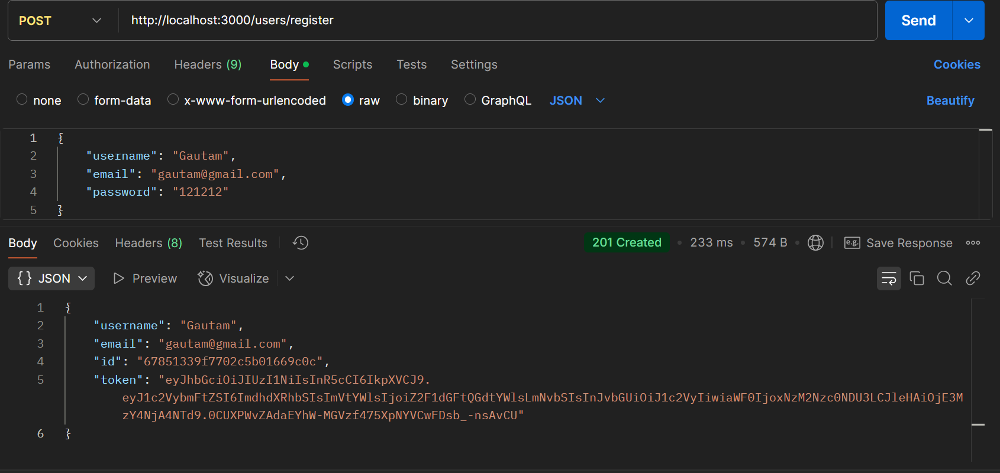
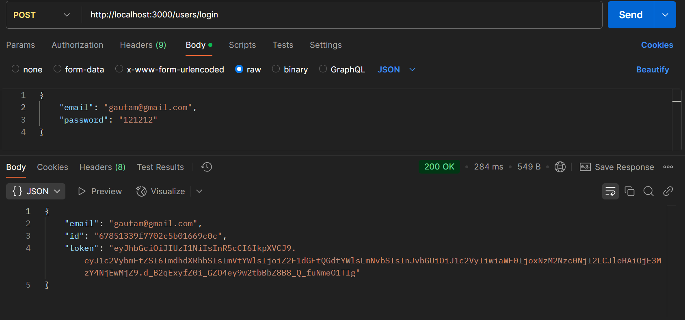
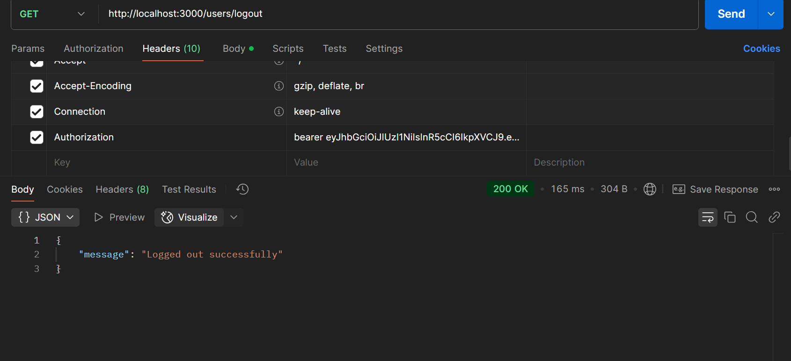
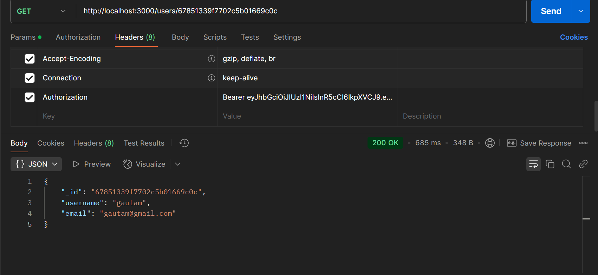
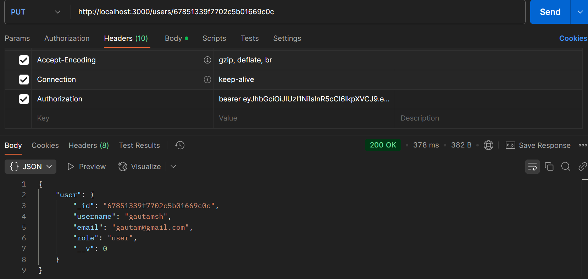

<h1 align="center">Event Management</h1>
<h2>How to Run Locally</h2>
```shell
npm install
npx nodemon
```

<h1>User Management APIs</h1>
<p>Used JWT for authentication and Redis for logout functionality.</p>

<h2>Screenshots</h2>
<div>
<h4>User Register</h4>


<h4>User Login</h4>


<h4>User Logout</h4>


<h4>User Details Using ID</h4>


<h4>Update User</h4>


